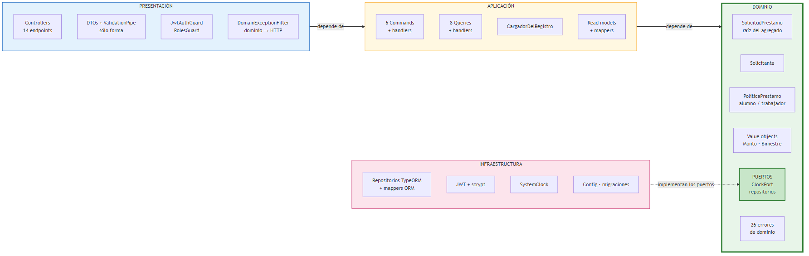
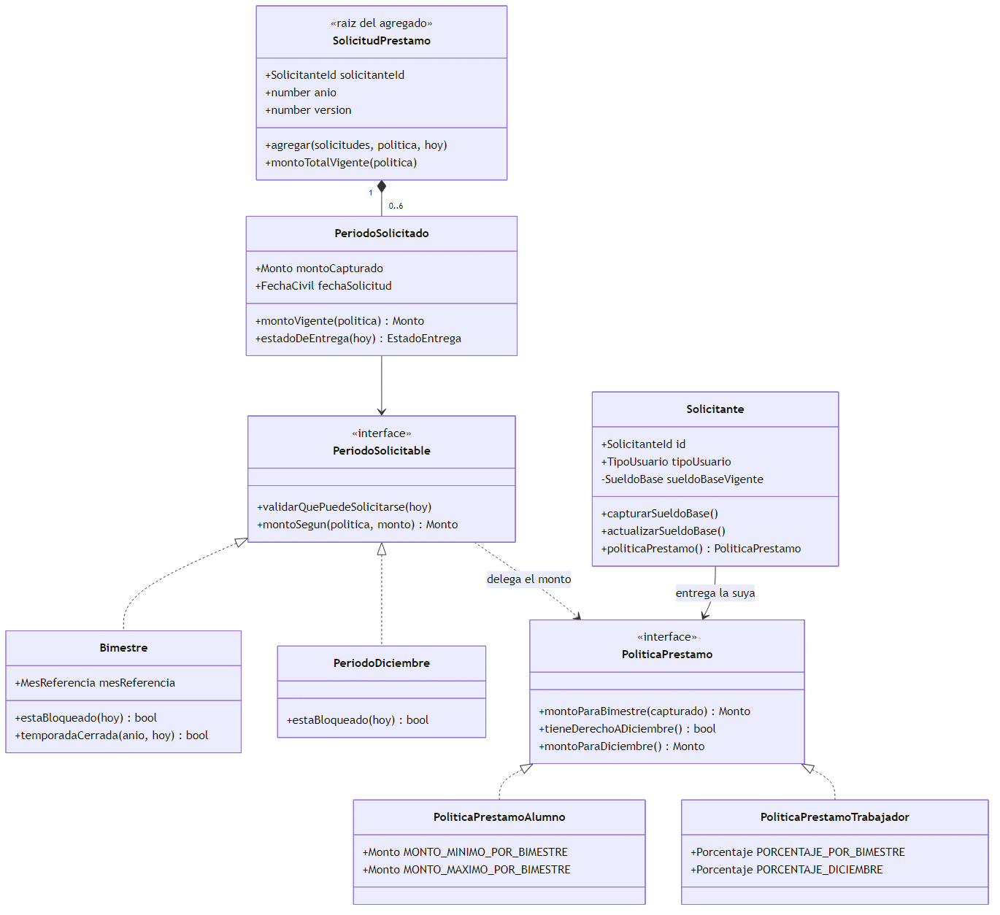
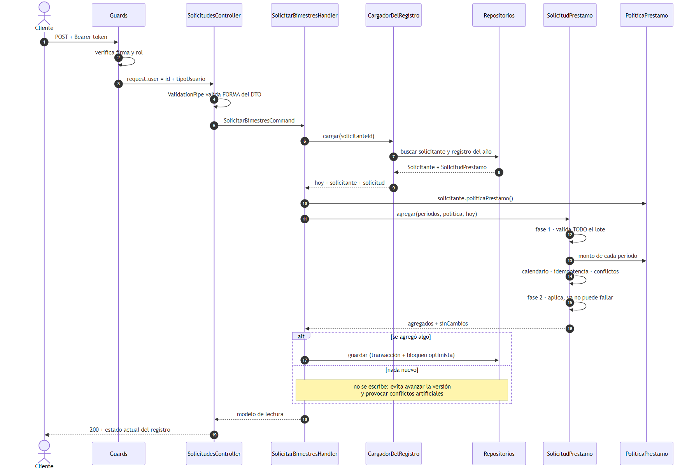
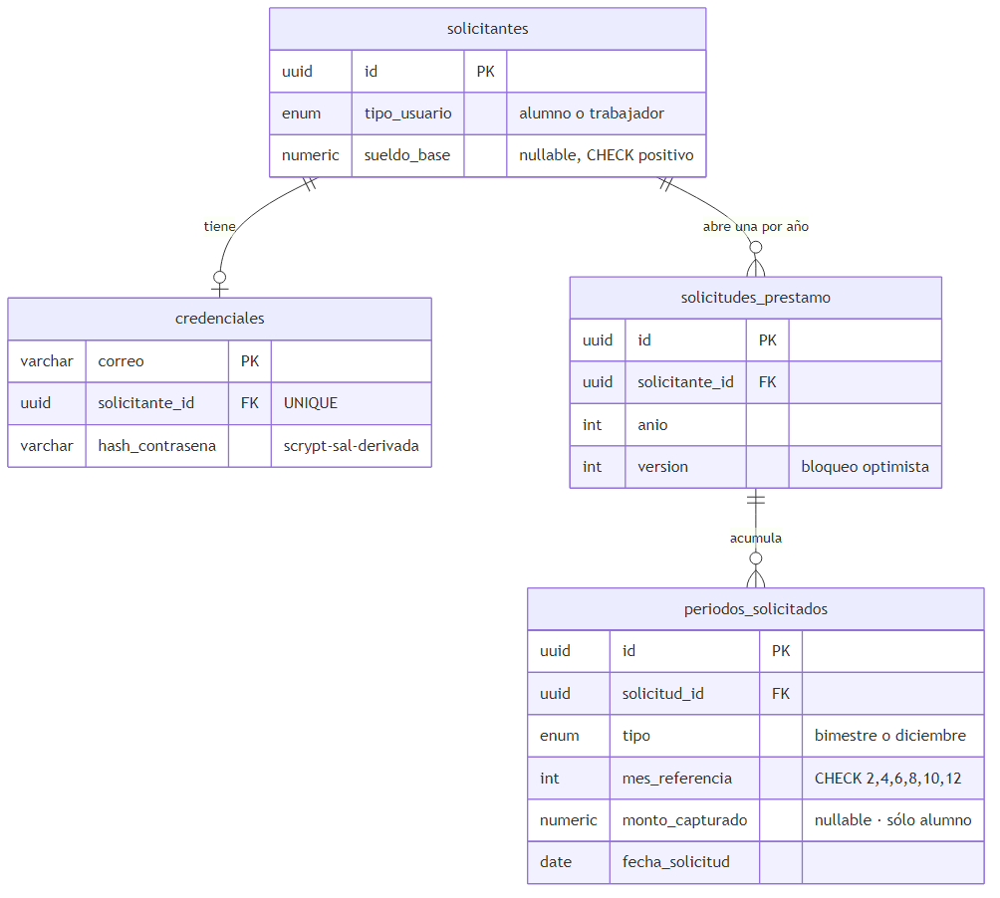
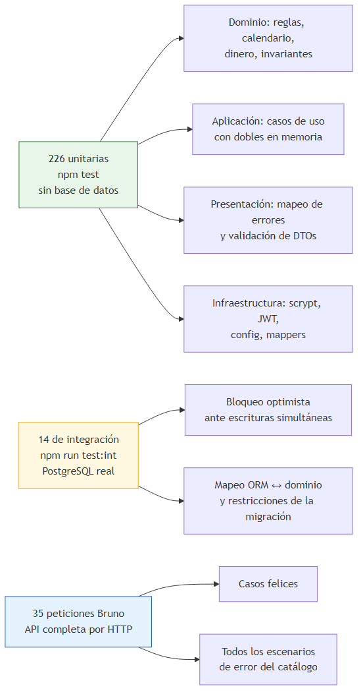

# Arquitectura — `prestamos-bimestrales`

_Vista técnica del microservicio: capas, dependencias, dónde vive cada regla de negocio y por
qué. Complementa a [`planteamiento.md`](planteamiento.md) (qué hace el sistema) y a
[`casos-de-uso.md`](casos-de-uso.md) (qué casos cubre)._

> Los diagramas están **exportados a imagen** en [`diagramas/`](diagramas), para que se vean en
> cualquier visor sin depender de un renderizador de Mermaid. Su fuente editable está junto a
> cada imagen; si cambias un `.mmd`, regenera las imágenes con `npm run docs:diagramas`.

---

## 1. La idea en una frase

**Las reglas del préstamo viven en el centro y no saben que existen NestJS, TypeORM ni HTTP.**
Todo lo demás —el framework, la base de datos, el token— son detalles intercambiables que se
conectan por puertos.

## 2. Vista de capas y regla de dependencias

Fuente editable: [`diagramas/1-capas.mmd`](diagramas/1-capas.mmd)

**Todas las flechas apuntan hacia adentro.** El dominio no tiene ninguna saliente: es el único
paquete del proyecto sin una sola dependencia externa. Y no hay atajos: presentación **no salta**
al dominio ni a la infraestructura, siempre pasa por un caso de uso.

> **La regla no se confía a la disciplina: la verifica el linter.** `eslint.config.js` prohíbe
> que `src/domain/**` importe `@nestjs/*`, `typeorm`, `express` o cualquier capa externa, y que
> `src/application/**` importe adaptadores concretos. Saltársela es un error de `npm run lint`,
> no un descuido que se cuela en una revisión.

## 3. Inversión de dependencias: puertos y adaptadores

El dominio y la aplicación **declaran lo que necesitan**; la infraestructura lo provee. El
cableado vive entero en `src/app.module.ts`, y siempre contra tokens de interfaz.

| Puerto (quién lo declara) | Token | Adaptador (infraestructura) |
|---|---|---|
| `ClockPort` — dominio | `CLOCK_PORT` | `SystemClock` |
| `SolicitudPrestamoRepository` — dominio | `SOLICITUD_PRESTAMO_REPOSITORY` | `SolicitudPrestamoRepositoryImpl` |
| `SolicitanteRepository` — dominio | `SOLICITANTE_REPOSITORY` | `SolicitanteRepositoryImpl` |
| `CredencialesPort` — aplicación | `CREDENCIALES_PORT` | `CredencialesAdapter` (scrypt) |
| `TokenIssuerPort` — aplicación | `TOKEN_ISSUER_PORT` | `JwtTokenIssuerAdapter` |
| `IdGeneratorPort` — aplicación | `ID_GENERATOR_PORT` | `UuidGeneratorAdapter` |

Cambiar PostgreSQL por otra cosa, o el JWT por otro esquema, es escribir un adaptador nuevo y
cambiar **una línea** del módulo. Ni el dominio ni los casos de uso se enteran.

Es también lo que hace que las pruebas sean baratas: el mismo contrato lo cumplen
`SystemClock` y el `RelojFijo` de las pruebas, o el repositorio de TypeORM y uno en memoria.

## 4. Modelo de dominio

Fuente editable: [`diagramas/2-modelo-de-dominio.mmd`](diagramas/2-modelo-de-dominio.mmd)

`TipoUsuario` es **inmutable** tras el alta, y `montoCapturado` es **nulo para el trabajador**:
su monto no se guarda, se deriva. Los límites del alumno son $0.01 y $3,500.00 **por bimestre**;
los del trabajador, 16 % y 32 % del sueldo base vigente.

**Las dos jerarquías se cruzan sin conocerse.** El monto depende de dos cosas a la vez —el tipo
de usuario y el tipo de periodo— y ninguna de las dos pregunta por la otra: `Bimestre` pide
`montoParaBimestre` y `PeriodoDiciembre` pide `montoParaDiciembre`; cada política responde a su
manera. Añadir un tipo de usuario no toca el calendario, y añadir un periodo no toca las
políticas (principio Abierto/Cerrado).

## 5. Flujo de una petición

`POST /solicitudes/bimestres` — el botón **"Solicitar"** del planteamiento:

Fuente editable: [`diagramas/3-flujo-de-una-peticion.mmd`](diagramas/3-flujo-de-una-peticion.mmd)

Si algo falla, el error de dominio **sube sin tocarse** hasta el `DomainExceptionFilter`, que
lo traduce a HTTP por su código estable. La aplicación no convierte errores; la presentación no
inventa reglas.

## 6. Dónde vive cada regla de negocio

La tabla que responde a "¿y esto dónde se decide?":

| Regla | Pieza responsable | Capa |
|---|---|---|
| RN-02 · Cuáles son los cinco bimestres | `Bimestre.MESES_REFERENCIA` | Dominio |
| RN-04 · Bloqueo de un bimestre transcurrido | `Bimestre.validarQuePuedeSolicitarse` | Dominio |
| RN-05 · Cierre de temporada tras octubre | `Bimestre.temporadaCerrada` | Dominio |
| RN-06 · Un registro por usuario y año | `SolicitudPrestamo` + índice único | Dominio + BD |
| RN-07 · La entrega no se adelanta | `EstadoEntrega.derivar` sobre `Periodo` | Dominio |
| RN-08 · 16 % del sueldo base | `PoliticaPrestamoTrabajador` | Dominio |
| RN-09 · Rango 0.01–3500 por bimestre | `PoliticaPrestamoAlumno` | Dominio |
| RN-10 / RN-12 · Diciembre, sólo trabajadores | `PeriodoDiciembre` + política | Dominio |
| RN-11 · Diciembre ajeno al cierre de octubre | `PeriodoDiciembre` (calendario propio) | Dominio |
| RN-13 · El sueldo flota | `Solicitante.actualizarSueldoBase` | Dominio |
| RN-14 / RN-19 · Centavos y redondeo half-up | `Monto` | Dominio |
| RN-15 · Concurrencia | `UPDATE … WHERE version` + índice único | Infraestructura |
| RN-18 · Idempotencia y atomicidad | `SolicitudPrestamo.agregar` (dos fases) | Dominio |
| RN-17 · Autenticación y roles | Guards + estrategia JWT | Presentación + Infra |
| Forma de la petición | DTOs + `ValidationPipe` | Presentación |

**Catorce de dieciséis filas caen en el dominio.** Ése es el resultado que persigue la
arquitectura: que casi ninguna regla dependa del framework.

## 7. Modelo de datos

Fuente editable: [`diagramas/4-modelo-de-datos.mmd`](diagramas/4-modelo-de-datos.mmd)

Dos detalles que el esquema hace cumplir y conviene señalar en la defensa:

- **`UQ_solicitud_solicitante_anio`** es RN-06 escrito en la base: un registro por usuario y año.
- **`monto_capturado` es nulo para el trabajador**, y no es un olvido: su monto **no se
  almacena**, se deriva del sueldo vigente en cada lectura.

## 8. Las cuatro decisiones que explican el resto

| Decisión | Por qué | Consecuencia |
|---|---|---|
| **El monto del trabajador no se persiste, se deriva** | Es función pura del sueldo vigente, y no hay historial ni snapshots (RN-13, RN-20) | Actualizar el sueldo **recalcula todo por construcción**: CU-B02 no reescribe ni una fila y la base no puede desincronizarse |
| **El dominio nunca lee el reloj** | El "ahora" entra por `ClockPort` y se convierte una sola vez a día civil de `America/Mexico_City` | El bloqueo de bimestres se prueba en cualquier fecha del año de forma determinista |
| **Dinero en centavos enteros, half-up en un solo sitio** | `0.1 + 0.2 !== 0.3`, y aquí se acumulan montos y se calculan porcentajes | Los montos viajan por la API como cadena (`"1975.31"`), nunca como `number` |
| **CQRS con interfaces propias, no `@nestjs/cqrs`** | Deja la capa de aplicación libre de framework | Los casos de uso se prueban instanciándolos con dobles, sin contenedor ni módulos de prueba |

## 9. Estrategia de pruebas

Fuente editable: [`diagramas/5-estrategia-de-pruebas.mmd`](diagramas/5-estrategia-de-pruebas.mmd)

El reparto no es casual: **si una regla de negocio necesitara PostgreSQL para probarse, estaría
mal ubicada.** Las de integración existen sólo para lo que un doble no puede demostrar —que dos
transacciones simultáneas no se pisen, que el `numeric` vuelva sin perder centavos— y por eso
van en un comando aparte, para que `npm test` siga corriendo sin base de datos.

La prueba de concurrencia está verificada por mutación: quitando la condición `WHERE version`
del `UPDATE`, falla. Una prueba de concurrencia que pasa siempre no demuestra nada.

## 10. Qué queda fuera del alcance, y por qué

Por decisión del planteamiento y del registro de decisiones (RN-16): **intereses, plazos y
formas de pago**, el **proceso de desembolso** —la entrega es estado derivado de la fecha, no un
comando—, la **cancelación** de periodos, el **historial de sueldos** y la provisión externa del
sueldo base.

No están "pendientes": están **descartados** con su justificación en
[`casos-de-uso.md`](casos-de-uso.md) §7.
